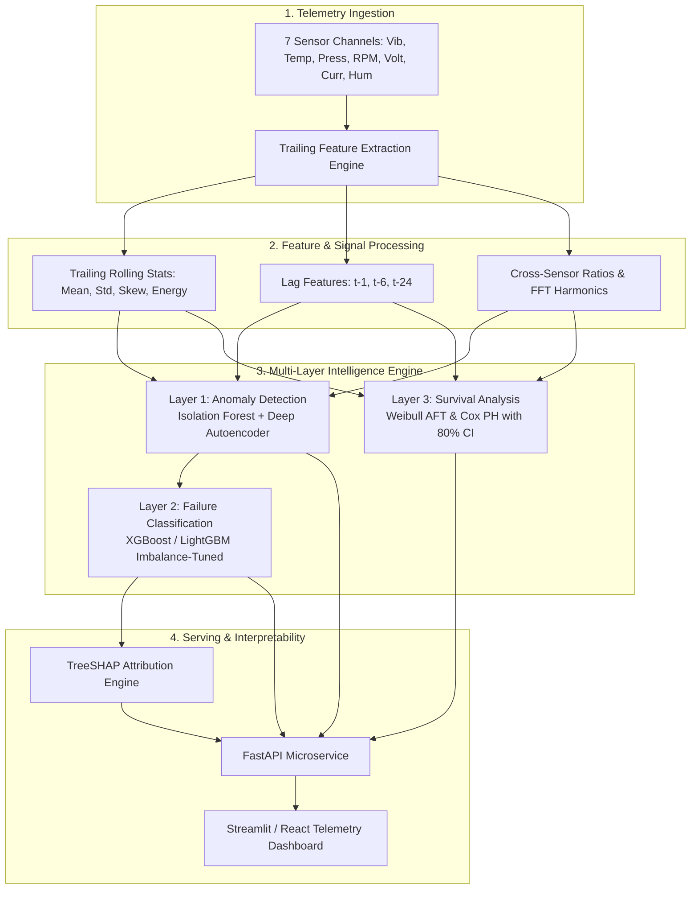

# Foresight System Architecture & Technical Specifications

Foresight is engineered as a multi-tier modular pipeline that decouples data ingestion, feature transformation, layered statistical modeling, and asynchronous inference serving.

---

## Component Details

### 1. Ingestion & Preprocessing (`src/data/`)
- Ingests high-frequency sensor readings across 7 channels.
- Enforces strict trailing-window temporal sequencing without lookahead leakage.

### 2. Feature Engineering (`src/features/`)
- **`rolling_stats.py`**: Trailing rolling mean, standard deviation, skewness, and peak-to-peak amplitude.
- **`lags.py`**: Multi-scale lag vectors capturing short and long-term state velocity.
- **`rates.py`**: First and second-order temporal derivatives (acceleration of degradation).
- **`fft.py`**: Fast Fourier Transform spectral energy and dominant frequency decomposition for rotational vibration telemetry.

### 3. Layered Modeling (`src/models/`)
- **Anomaly Detection (`anomaly/`)**: Baseline deviation scoring trained strictly on nominal operating states.
- **Failure Classification (`classifier/`)**: Gradient boosted trees tuned with `scale_pos_weight` for 7-day failure horizon prediction.
- **Survival Analysis (`survival/`)**: Parametric and semi-parametric time-to-event curves providing confidence intervals for Remaining Useful Life.

### 4. Explainability & Health Scoring (`src/explainability/`, `src/health_score.py`)
- Calculates local Shapley values to pinpoint dominant physical failure mechanisms.
- Synthesizes a calibrated **Health Score (0–100)** for real-time asset monitoring.
