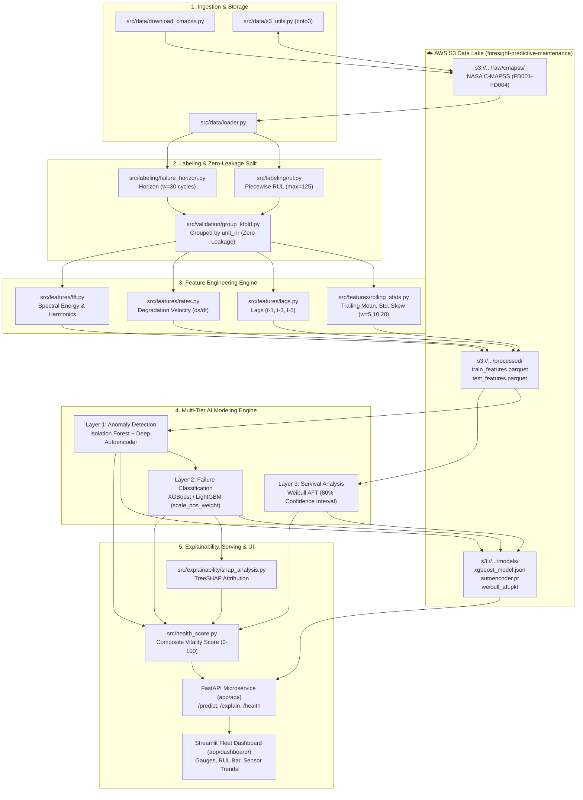

# ⚙️ Foresight System Architecture & AWS Technical Specifications

Foresight is engineered as an industrial-grade, cloud-integrated predictive maintenance platform. It decouples high-throughput telemetry ingestion, AWS S3 data lake storage, zero-leakage signal processing, multi-layer statistical modeling, and asynchronous REST serving.

---

## 🏗️ End-to-End Cloud & Pipeline Architecture



---

## ☁️ AWS Cloud Infrastructure Specifications

### 1. Amazon S3 Bucket Architecture
- **Bucket Identifier**: Configured via `S3_BUCKET_NAME` in `.env` (e.g. `foresight-predictive-maintenance`).
- **Region**: Configured via `AWS_REGION` (e.g. `us-east-1`).
- **Directory Hierarchy**:
  ```text
  s3://foresight-predictive-maintenance/
  ├── raw/
  │   └── cmapss/
  │       ├── train_FD001.txt
  │       ├── test_FD001.txt
  │       ├── RUL_FD001.txt
  │       ├── train_FD002.txt ... (FD002 to FD004)
  │       └── readme.txt
  ├── processed/
  │   ├── train_features.parquet    <-- Engineered tabular feature matrix (train units)
  │   ├── test_features.parquet     <-- Engineered tabular feature matrix (test units)
  │   └── scaler.joblib             <-- Fitted feature standardizer (fitted ONLY on train)
  └── models/
      ├── isolation_forest.joblib   <-- Layer 1 anomaly estimator
      ├── autoencoder.pt            <-- Layer 1 PyTorch deep autoencoder weights
      ├── xgboost_failure.json      <-- Layer 2 calibrated gradient boosting model
      ├── weibull_aft.pkl           <-- Layer 3 parametric survival model
      └── metadata.json             <-- Training metrics, PR-AUC, timestamps, hyperparams
  ```

### 2. IAM & Authentication Contract
All interactions with S3 authenticate through `src/data/s3_utils.py` leveraging standard environment variables:
- `AWS_ACCESS_KEY_ID`
- `AWS_SECRET_ACCESS_KEY`
- `AWS_REGION`
- `S3_BUCKET_NAME`

---

## 📊 Dataset Specifications: NASA C-MAPSS (FD001)

### 1. Raw Telemetry Schema
Each row represents an operational snapshot during 1 flight cycle (26 space-separated columns):

| Column Index | Field Name | Description | Units / Notes |
|---|---|---|---|
| 0 | `unit_nr` | Engine identifier | Integer ($1\text{ to }100$) |
| 1 | `time_cycles` | Flight cycle number | Integer ($1, 2, \dots, T_{\max}$) |
| 2 | `setting_1` | Altitude | Flight regime condition |
| 3 | `setting_2` | Mach number | Flight regime condition |
| 4 | `setting_3` | Throttle Resolver Angle (TRA) | Constant in FD001 ($100.0$) |
| 5–25 | `s_1` to `s_21` | Physical sensor measurements | Temperatures, pressures, speeds, flows |

### 2. Physical Sensor Mapping
```text
s_1 : T2        - Total temperature at fan inlet (°R) [Invariant in FD001]
s_2 : T24       - Total temperature at LPC outlet (°R)
s_3 : T30       - Total temperature at HPC outlet (°R) [Key degradation sensor]
s_4 : T50       - Total temperature at LPT outlet (°R)
s_5 : P2        - Pressure at fan inlet (psia) [Invariant in FD001]
s_6 : P15       - Total pressure in bypass-duct (psia) [Invariant in FD001]
s_7 : P30       - Total pressure at HPC outlet (psia)
s_8 : Nf        - Physical fan speed (rpm)
s_9 : Nc        - Physical core speed (rpm)
s_10: epr       - Engine pressure ratio (P50/P2) [Invariant in FD001]
s_11: Ps30      - Static pressure at HPC outlet (psia) [Key degradation sensor]
s_12: phi       - Ratio of fuel flow to Ps30 (pps/psi)
s_13: NRf       - Corrected fan speed (rpm)
s_14: NRc       - Corrected core speed (rpm)
s_15: BPR       - Bypass Ratio [Key degradation sensor]
s_16: farB      - Burner fuel-air ratio [Invariant in FD001]
s_17: htBleed   - Bleed Enthalpy
s_18: Nf_dmd    - Demanded fan speed (rpm) [Invariant in FD001]
s_19: PCNfR_dmd - Demanded corrected fan speed (rpm) [Invariant in FD001]
s_20: W31       - HPT coolant bleed (lbm/s)
s_21: W32       - LPT coolant bleed (lbm/s)
```

> [!NOTE]
> **Active Degradation Sensors in FD001 (14 channels)**:
> `T24`, `T30`, `T50`, `P30`, `Nf`, `Nc`, `Ps30`, `phi`, `NRf`, `NRc`, `BPR`, `htBleed`, `W31`, `W32`.
> The remaining 7 sensors have constant variance and must be dropped during feature preprocessing to prevent singular matrices.

---

## 🔬 Component Interfaces & Mathematical Formulation

### 1. Labeling Layer (`src/labeling/`)
- **True Remaining Useful Life (RUL)**:
  $$\text{RUL}_{i, t} = T_{\max, i} - t$$
- **Piecewise-Linear Clipped RUL**:
  $$\text{RUL}_{\text{clipped}} = \min(\text{RUL}, 125)$$
- **Failure Horizon Target**:
  $$\text{failure\_in\_horizon} = \mathbb{I}(\text{RUL} \le 30)$$

### 2. Validation Framework (`src/validation/`)
- **Engine-Grouped Cross-Validation**:
  $$\text{Units}_{\text{train}} \cap \text{Units}_{\text{val}} = \emptyset$$
  5-fold cross-validation partitioned strictly along the `unit_nr` boundary using `GroupKFold`.

### 3. Feature Engineering Layer (`src/features/`)
- **Trailing Windows**: Windows of length $W \in \{5, 10, 20\}$ computed with `closed='left'` or `.shift(1)` to enforce zero lookahead.
- **Aggregations**: Trailing Mean ($\mu$), Standard Deviation ($\sigma$), Min, Max, Skewness, Rate of Change ($\Delta s / \Delta t$).

### 4. Layered Modeling Engine (`src/models/`)
- **Layer 1: Anomaly Detection**:
  - `IsolationForest`: Trained on nominal early cycles ($\text{RUL} > 100$). Anomaly score normalized to $[0, 1]$.
  - `PyTorch Autoencoder`: 14 $\rightarrow$ 32 $\rightarrow$ 16 $\rightarrow$ 4 bottleneck. Reconstruction MSE $\|x - \hat{x}\|^2$.
- **Layer 2: Failure Horizon Classification**:
  - `XGBoostClassifier` / `LightGBMClassifier` on binary target `failure_in_horizon`.
  - Tuned with `scale_pos_weight = N_{\text{neg}} / N_{\text{pos}}$ for class imbalance.
  - Evaluation: PR-AUC ($\ge 0.85$), ROC-AUC ($\ge 0.90$).
- **Layer 3: Survival Analysis**:
  - `lifelines.WeibullAFTFitter`: Parametric accelerated failure time model.
  - Generates survival curves $S(t | X)$ and **80% Confidence Interval** for RUL ($10\text{th}$ to $90\text{th}$ percentile).

### 5. Explainability & Health Scoring (`src/explainability/`, `src/health_score.py`)
- **TreeSHAP**: Computes Shapley attribution values for active sensors.
- **Physical Root Cause Mapper**: Maps top 3 SHAP features to human-readable aerospace diagnostic text.
- **Composite Health Score ($0\text{--}100$)**:
  $$\text{HealthScore} = 100 \times \left(1 - 0.5 \cdot P(\text{fail}) - 0.3 \cdot \text{AnomalyScore} - 0.2 \cdot \left(1 - \frac{\text{RUL}_{\text{clipped}}}{125}\right)\right)$$

---

## 🚀 Serving Layer (`app/`)
- **FastAPI Backend**:
  - `GET /health` $\rightarrow$ status check & loaded model versions.
  - `POST /predict` $\rightarrow$ input sensor snapshot $\rightarrow$ returns failure probability, 80% CI RUL, health score.
  - `POST /explain` $\rightarrow$ returns top-3 SHAP physical drivers.
- **Streamlit Fleet Dashboard**:
  - Fleet view of 100 aircraft turbofan engines with color-coded health indicators.
  - Drill-down telemetry graphs for individual engines.
  - SHAP waterfall diagnostic card.
